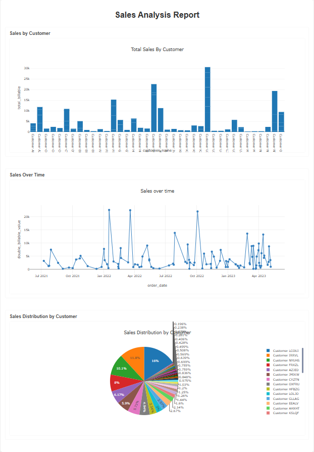

# Elusion 🦀 DataFrame Library for Everybody!


Elusion is a high-performance DataFrame library designed for in-memory data formats such as CSV, JSON, PARQUET, DELTA, as well as for ODBC Database Connections for MySQL and PostgreSQL, as well as for Azure Blob Storage Connections.

All of the DataFrame operations, Reading and Writing can be placed in PipelineScheduler for automated Data Engineering Pipelines.

DataFrame operations are built atop the DataFusion SQL query engine, Database operations are built atop Arrow ODBC, Azure BLOB HTTPS operations are built atop Azure Storage with BLOB and DFS (Data Lake Storage Gen2) endpoints available, Pipeline Scheduling is built atop Tokio Cron Scheduler. (scroll down for examples)

Tailored for Data Engineers and Data Analysts seeking a powerful abstraction over data transformations. Elusion streamlines complex operations like filtering, joining, aggregating, and more with its intuitive, chainable DataFrame API, and provides a robust interface for managing and querying data efficiently.

## Core Philosophy
Elusion wants you to be you!

Elusion offers flexibility in constructing queries without enforcing specific patterns or chaining orders, unlike SQL, PySpark, Polars, or Pandas. You can build your queries in any sequence that best fits your logic, writing functions in a manner that makes sense to you. Regardless of the order of function calls, Elusion ensures consistent results.

## Platform Compatibility
Tested for MacOS, Linux and Windows


## Security
Codebase has Undergone Rigorous Auditing and Security Testing, ensuring that it is fully prepared for Production.

## Key Features

### 🔄 Job Scheduling (PipelineScheduler)
Flexible Intervals: From 1 minute to 30 days scheduling intervals.
Graceful Shutdown: Built-in Ctrl+C signal handling for clean termination.
Async Support: Built on tokio for non-blocking operations.

### 🌐 External Data Sources Integration
- Azure Blob Storage: Direct integration with Azure Blob Storage for Reading and Writing data files.
- Database Connectors: ODBC support for seamless data access from MySQL and PostgreSQL databases.

### 🚀 High-Performance DataFrame Operations
Seamless Data Loading: Easily load and process data from CSV, PARQUET, JSON, and DELTA table files.
SQL-Like Transformations: Execute transformations such as SELECT, AGG, STRING FUNCTIONS, JOIN, FILTER, GROUP BY, and WINDOW with ease.

### 📉 Aggregations and Analytics
Comprehensive Aggregations: Utilize built-in functions like SUM, AVG, MEAN, MEDIAN, MIN, COUNT, MAX, and more.
Advanced Scalar Math: Perform calculations using functions such as ABS, FLOOR, CEIL, SQRT, ISNAN, ISZERO, PI, POWER, and others.

### 🔗 Flexible Joins
Diverse Join Types: Perform joins using INNER, LEFT, RIGHT, FULL, and other join types.
Intuitive Syntax: Easily specify join conditions and aliases for clarity and simplicity.

### 🪟 Window Functions
Analytical Capabilities: Implement window functions like RANK, DENSE_RANK, ROW_NUMBER, and custom partition-based calculations to perform advanced analytics.

### 🔄 Pivot and Unpivot Functions
Data Reshaping: Transform your data structure using PIVOT and UNPIVOT functions to suit your analytical needs.

### 📊 Plotting
You can create individual HTML files with single Plot, OR you can create HTML reports with multiple Plots: Bar, Line, Pie, Donut, Histogram, TimeSeries...

### 🧹 Clean Query Construction
Readable Queries: Construct SQL queries that are both readable and reusable.
Advanced Query Support: Utilize Common Table Expressions (CTEs), subqueries, and set operations such as UNION, UNION ALL, INTERSECT, and EXCEPT.

### 🛠️ Easy-to-Use API
Chainable Interface: Build queries using a chainable and intuitive API for streamlined development.
Debugging Support: Access readable debug outputs of the generated SQL for easy verification and troubleshooting.
**Data Preview**: Quickly preview your data by displaying a subset of rows in the terminal.
**Composable Queries**: Seamlessly chain transformations to create reusable and testable workflows.

---
## Installation

To add **Elusion** to your Rust project, include the following lines in your `Cargo.toml` under `[dependencies]`:

```toml
elusion = "1.7.1"
tokio = { version = "1.42.0", features = ["rt-multi-thread"] }
```
## Rust version needed
```toml
>= 1.81
```
---
# Usage examples:

### MAIN function 

```rust
// Import everything needed
use elusion::prelude::*; 

#[tokio::main]
async fn main() -> ElusionResult<()> {

    Ok(())
}

```
## Schema 
#### SCHEMA IS DYNAMICALLY INFERED since v0.2.5
---
## LOADING
### - Loading data into CustomDataFrame can be from:
#### - In-Memory data formats: CSV, JSON, PARQUET, DELTA 
#### - Azure Blob Storage endpoints (BLOB, DFS)
#### - REST API endpoints
#### - ODBC Connectors (databases)

#### -> NEXT is example for reading data from local files, 
#### down bellow are examples for Azure Blob Storage, REST APIs and ODBC
---
### LOADING data from Files into CustomDataFrame (in-memory data formats)
#### - File extensions are automatically recognized 
#### - All you have to do is to provide path to your file
```rust
let csv_data = "C:\\Borivoj\\RUST\\Elusion\\sales_data.csv";
let parquet_path = "C:\\Borivoj\\RUST\\Elusion\\prod_data.parquet";
let json_path = "C:\\Borivoj\\RUST\\Elusion\\db_data.json";
let delta_path = "C:\\Borivoj\\RUST\\Elusion\\agg_sales"; // for DELTA you just specify folder name without extension
```
### Creating CustomDataFrame
#### 2 arguments needed:  **Path**, **Table Alias**

```rust
let df_sales = CustomDataFrame::new(csv_data, "sales").await?; 
let df_customers = CustomDataFrame::new(parquet_path, "customers").await?;
```
---

### ALIAS column names in SELECT() function (AS is case insensitive)
```rust
let customers_alias = df_customers
    .select(["CustomerKey AS customerkey_alias", "FirstName as first_name", "LastName", "EmailAddress"]);
```
---
## Where to use which Functions:
### Scalar and Operators -> in SELECT() function
### Aggregation Functions -> in AGG() function
### String Column Functions -> in STRING_FUNCTIONS() function
---
### Numerical Operators (supported +, -, * , / , %)
```rust
let num_ops_sales = sales_order_df.clone()
    .select([
        "customer_name",
        "order_date",
        "billable_value",
        "billable_value * 2 AS double_billable_value",  // Multiplication
        "billable_value / 100 AS percentage_billable"  // Division
    ])
    .filter("billable_value > 100.0")
    .order_by(["order_date"], [true])
    .limit(10);

let num_ops_res = num_ops_sales.elusion("scalar_df").await?;
num_ops_res.display().await?;
```
### FILTERING
```rust
let filter_df = sales_order_df
    .select(["customer_name", "order_date", "billable_value"])
    .filter_many([("order_date > '2021-07-04'"), ("billable_value > 100.0")])
    .order_by(["order_date"], [true])
    .limit(10);

let filtered = filter_df.elusion("result_sales").await?;
filtered.display().await?;
```
### SCALAR functions
```rust
let scalar_df = sales_order_df
    .select([
        "customer_name", 
        "order_date", 
        "ABS(billable_value) AS abs_billable_value",
        "ROUND(SQRT(billable_value), 2) AS SQRT_billable_value"])
    .filter("billable_value > 100.0")
    .order_by(["order_date"], [true])
    .limit(10);

let scalar_res = scalar_df.elusion("scalar_df").await?;
scalar_res.display().await?;
```
### AGGREGATE functions with nested Scalar functions 
```rust
let scalar_df = sales_order_df
    .select([
        "customer_name", 
        "order_date"
    ])
    .agg([
        "ROUND(AVG(ABS(billable_value)), 2) AS avg_abs_billable",
        "SUM(billable_value) AS total_billable",
        "MAX(ABS(billable_value)) AS max_abs_billable",
        "SUM(billable_value) * 2 AS double_total_billable",      // Operator-based aggregation
        "SUM(billable_value) / 100 AS percentage_total_billable" // Operator-based aggregation
    ])
    .group_by(["customer_name", "order_date"])
    .filter("billable_value > 100.0")
    .order_by(["order_date"], [true])
    .limit(10);

let scalar_res = scalar_df.elusion("scalar_df").await?;
scalar_res.display().await?;
```
### Numerical Operators, Scalar Functions, Aggregated Functions...
```rust
let mix_query = sales_order_df
    .select([
        "customer_name",
        "order_date",
        "ABS(billable_value) AS abs_billable_value",
        "ROUND(SQRT(billable_value), 2) AS SQRT_billable_value",
        "billable_value * 2 AS double_billable_value",  // Multiplication
        "billable_value / 100 AS percentage_billable"  // Division
    ])
    .agg([
        "ROUND(AVG(ABS(billable_value)), 2) AS avg_abs_billable",
        "SUM(billable_value) AS total_billable",
        "MAX(ABS(billable_value)) AS max_abs_billable",
        "SUM(billable_value) * 2 AS double_total_billable",      // Operator-based aggregation
        "SUM(billable_value) / 100 AS percentage_total_billable" // Operator-based aggregation
    ])
    .filter("billable_value > 50.0")
    .group_by_all()
    .order_by_many([
        ("total_billable", false),  // Order by total_billable descending
        ("max_abs_billable", true), // Then by max_abs_billable ascending
    ]);

let mix_res = mix_query.elusion("scalar_df").await?;
mix_res.display().await?;
```
---
### Supported Aggregation functions
```rust
SUM, AVG, MEAN, MEDIAN, MIN, COUNT, MAX,  
LAST_VALUE, FIRST_VALUE,  
GROUPING, STRING_AGG, ARRAY_AGG, VAR, VAR_POP,  
VAR_POPULATION, VAR_SAMP, VAR_SAMPLE,  
BIT_AND, BIT_OR, BIT_XOR, BOOL_AND, BOOL_OR 
```
### Supported Scalar Math Functions
```rust
ABS, FLOOR, CEIL, SQRT, ISNAN, ISZERO,  
PI, POW, POWER, RADIANS, RANDOM, ROUND,  
FACTORIAL, ACOS, ACOSH, ASIN, ASINH,  
COS, COSH, COT, DEGREES, EXP,  
SIN, SINH, TAN, TANH, TRUNC, CBRT,  
ATAN, ATAN2, ATANH, GCD, LCM, LN,  
LOG, LOG10, LOG2, NANVL, SIGNUM
```
---
## JOIN
#### JOIN examples with single condition and 2 dataframes, AGGREGATION, GROUP BY
```rust
let single_join = df_sales
    .join(df_customers, ["s.CustomerKey = c.CustomerKey"], "INNER")
    .select(["s.OrderDate","c.FirstName", "c.LastName"])
    .agg([
        "SUM(s.OrderQuantity) AS total_quantity",
        "AVG(s.OrderQuantity) AS avg_quantity",
    ])
    .group_by(["s.OrderDate","c.FirstName","c.LastName"])
    .having("total_quantity > 10") 
    .order_by(["total_quantity"], [false]) // true is ascending, false is descending
    .limit(10);

let join_df1 = single_join.elusion("result_query").await?;
join_df1.display().await?;
```
### JOIN with single conditions and 3 dataframes, AGGREGATION, GROUP BY, HAVING, SELECT, ORDER BY
```rust
let many_joins = df_sales
    .join_many([
        (df_customers, ["s.CustomerKey = c.CustomerKey"], "INNER"),
        (df_products, ["s.ProductKey = p.ProductKey"], "INNER"),
    ]) 
    .select([
        "c.CustomerKey","c.FirstName","c.LastName","p.ProductName",
    ]) 
    .agg([
        "SUM(s.OrderQuantity) AS total_quantity",
        "AVG(s.OrderQuantity) AS avg_quantity",
    ]) 
    .group_by(["c.CustomerKey", "c.FirstName", "c.LastName", "p.ProductName"]) 
    .having_many([("total_quantity > 10"), ("avg_quantity < 100")]) 
    .order_by_many([
        ("total_quantity", true), // true is ascending 
        ("p.ProductName", false)  // false is descending
    ])
    .limit(10); 

let join_df3 = many_joins.elusion("df_joins").await?;
join_df3.display().await?;
```
### JOIN with multiple conditions and 2 data frames
```rust
let result_join = orders_df
    .join(
        customers_df,
        ["o.CustomerID = c.CustomerID" , "o.RegionID = c.RegionID"],
        "INNER"
    )
    .select([
        "o.OrderID",
        "c.Name",
        "o.OrderDate"
    ])
    .string_functions([
        "CONCAT(TRIM(c.Name), ' (', c.Email, ')') AS customer_info",
        "UPPER(c.Status) AS customer_status",
        "LEFT(c.Email, POSITION('@' IN c.Email) - 1) AS username"
    ])
    .agg([
        "SUM(o.Amount) AS total_amount",
        "AVG(o.Quantity) AS avg_quantity",
        "COUNT(DISTINCT o.OrderID) AS order_count",
        "MAX(o.Amount) AS max_amount",
        "MIN(o.Amount) AS min_amount"
    ])
    .group_by([
        "o.OrderID",
        "c.Name",
        "o.OrderDate",
        "c.Email",   
        "c.Status"
    ]);

let res_joins = result_join.elusion("one_join").await?;
res_joins.display().await?;
```
### JOIN_MANY with multiple conditions and 3 data frames
```rust
let result_join_many = order_join_df
    .join_many([
        (customer_join_df,
            ["o.CustomerID = c.CustomerID" , "o.RegionID = c.RegionID"],
            "INNER"
        ),
        (regions_join_df,
            ["c.RegionID = r.RegionID" , "r.IsActive = true"],
            "INNER"
        )
    ])
    .select(["o.OrderID","c.Name","r.RegionName", "r.CountryID"])
    .string_functions([
    "CONCAT(r.RegionName, ' (', r.CountryID, ')') AS region_info",
 
    "CASE c.CreditLimit 
        WHEN 1000 THEN 'Basic'
        WHEN 2000 THEN 'Premium'
        ELSE 'Standard'
    END AS credit_tier",

    "CASE 
        WHEN c.CreditLimit > 2000 THEN 'High'
        WHEN c.CreditLimit > 1000 THEN 'Medium'
        ELSE 'Low'
    END AS credit_status",

    "CASE
        WHEN o.Amount > 1000 AND c.Status = 'active' THEN 'Priority'
        WHEN o.Amount > 500 THEN 'Regular'
        ELSE 'Standard'
    END AS order_priority",

    "CASE r.RegionName
        WHEN 'East Coast' THEN 'Eastern'
        WHEN 'West Coast' THEN 'Western'
        ELSE 'Other'
    END AS region_category"

    "CASE
        WHEN EXTRACT(DOW FROM o.OrderDate) IN (0, 6) THEN 'Weekend'
        ELSE 'Weekday'
    END AS order_day_type"
    ])
    .agg([
        "SUM(o.Amount) AS total_amount",                                  
        "COUNT(*) AS row_count",                                       
        "SUM(o.Amount * (1 - o.Discount/100)) AS net_amount",          
        "ROUND(SUM(o.Amount) / COUNT(*), 2) AS avg_order_value",       
        "SUM(o.Amount * r.TaxRate) AS total_tax"                      
    ])
    .group_by_all()
    .having("total_amount > 200")
    .order_by(["total_amount"], [false]); 

let res_joins_many = result_join_many.elusion("many_join").await?;
res_joins_many.display().await?;
```
### JOIN_MANY with single condition and 3 dataframes, STRING FUNCTIONS, AGGREGATION, GROUP BY, HAVING_MANY, ORDER BY
```rust

let str_func_joins = df_sales
    .join_many([
        (df_customers, ["s.CustomerKey = c.CustomerKey"], "INNER"),
        (df_products, ["s.ProductKey = p.ProductKey"], "INNER"),
    ]) 
    .select([
        "c.CustomerKey",
        "c.FirstName",
        "c.LastName",
        "c.EmailAddress",
        "p.ProductName",
    ])
    .string_functions([
        "TRIM(c.EmailAddress) AS trimmed_email_address",
        "CONCAT(TRIM(c.FirstName), ' ', TRIM(c.LastName)) AS full_name",
        "LEFT(p.ProductName, 15) AS short_product_name",
        "RIGHT(p.ProductName, 5) AS end_product_name",
    ])
    .agg([
        "COUNT(p.ProductKey) AS product_count",
        "SUM(s.OrderQuantity) AS total_order_quantity",
    ])
    .group_by_all()
    .having_many([("total_order_quantity > 10"),  ("product_count >= 1")])  
    .order_by_many([
        ("total_order_quantity", true), 
        ("p.ProductName", false) 
    ]); 

let join_str_df3 = str_func_joins.elusion("df_joins").await?;
join_str_df3.display().await?;
```
#### Currently implemented join types
```rust
"INNER", "LEFT", "RIGHT", "FULL", 
"LEFT SEMI", "RIGHT SEMI", 
"LEFT ANTI", "RIGHT ANTI", "LEFT MARK" 
```
---
### STRING FUNCTIONS
```rust
let string_functions_df = df_sales
    .join_many([
        (df_customers, ["s.CustomerKey = c.CustomerKey"], "INNER"),
        (df_products, ["s.ProductKey = p.ProductKey"], "INNER"),
    ]) 
    .select([
        "c.CustomerKey",
        "c.FirstName",
        "c.LastName",
        "c.EmailAddress",
        "p.ProductName"
    ])
    .string_functions([
    // Basic String Functions
    "TRIM(c.EmailAddress) AS trimmed_email",
    "LTRIM(c.EmailAddress) AS left_trimmed_email",
    "RTRIM(c.EmailAddress) AS right_trimmed_email",
    "UPPER(c.FirstName) AS upper_first_name",
    "LOWER(c.LastName) AS lower_last_name",
    "LENGTH(c.EmailAddress) AS email_length",
    "LEFT(p.ProductName, 10) AS product_start",
    "RIGHT(p.ProductName, 10) AS product_end",
    "SUBSTRING(p.ProductName, 1, 5) AS product_substr",
    // Concatenation
    "CONCAT(c.FirstName, ' ', c.LastName) AS full_name",
    "CONCAT_WS(' ', c.FirstName, c.LastName, c.EmailAddress) AS all_info",
    // Position and Search
    "POSITION('@' IN c.EmailAddress) AS at_symbol_pos",
    "STRPOS(c.EmailAddress, '@') AS email_at_pos",
    // Replacement and Modification
    "REPLACE(c.EmailAddress, '@adventure-works.com', '@newdomain.com') AS new_email",
    "TRANSLATE(c.FirstName, 'AEIOU', '12345') AS vowels_replaced",
    "REPEAT('*', 5) AS stars",
    "REVERSE(c.FirstName) AS reversed_name",
    // Padding
    "LPAD(c.CustomerKey::TEXT, 10, '0') AS padded_customer_id",
    "RPAD(c.FirstName, 20, '.') AS padded_name",
    // Case Formatting
    "INITCAP(LOWER(c.FirstName)) AS proper_case_name",
    // String Extraction
    "SPLIT_PART(c.EmailAddress, '@', 1) AS email_username",
    // Type Conversion
    "TO_CHAR(s.OrderDate, 'YYYY-MM-DD') AS formatted_date"
    ])
    .agg([
        "COUNT(*) AS total_records",
        "STRING_AGG(p.ProductName, ', ') AS all_products"
    ])
    .filter("c.EmailAddress IS NOT NULL")
    .group_by_all()
    .having("COUNT(*) > 1")
    .order_by(["c.CustomerKey"], [true]);   

let str_df = string_functions_df.elusion("df_joins").await?;
str_df.display().await?;    
```
#### Currently Available String functions
```rust
1.Basic String Functions:
TRIM() - Remove leading/trailing spaces
LTRIM() - Remove leading spaces
RTRIM() - Remove trailing spaces
UPPER() - Convert to uppercase
LOWER() - Convert to lowercase
LENGTH() or LEN() - Get string length
LEFT() - Extract leftmost characters
RIGHT() - Extract rightmost characters
SUBSTRING() - Extract part of string
2. String concatenation:
CONCAT() - Concatenate strings
CONCAT_WS() - Concatenate with separator
3. String Position and Search:
POSITION() - Find position of substring
STRPOS() - Find position of substring
INSTR() - Find position of substring
LOCATE() - Find position of substring
4. String Replacement and Modification:
REPLACE() - Replace all occurrences of substring
TRANSLATE() - Replace characters
OVERLAY() - Replace portion of string
REPEAT() - Repeat string
REVERSE() - Reverse string characters
5. String Pattern Matching:
LIKE() - Pattern matching with wildcards
REGEXP() or RLIKE() - Pattern matching with regular expressions
6. String Padding:
LPAD() - Pad string on left
RPAD() - Pad string on right
SPACE() - Generate spaces
7. String Case Formatting:
INITCAP() - Capitalize first letter of each word
8. String Extraction:
SPLIT_PART() - Split string and get nth part
SUBSTR() - Get substring
9. String Type Conversion:
TO_CHAR() - Convert to string
CAST() - Type conversion
CONVERT() - Type conversion
10. Control Flow:
CASE()
```
---
### WINDOW functions
#### Aggregate, Ranking and Analytical functions
```rust
let window_query = df_sales
    .join(df_customers, ["s.CustomerKey = c.CustomerKey"], "INNER")
    .select(["s.OrderDate","c.FirstName","c.LastName","s.OrderQuantity"])
    //aggregated window functions
    .window("SUM(s.OrderQuantity) OVER (PARTITION BY c.CustomerKey ORDER BY s.OrderDate) as running_total")
    .window("AVG(s.OrderQuantity) OVER (PARTITION BY c.CustomerKey ORDER BY s.OrderDate) AS running_avg")
    .window("MIN(s.OrderQuantity) OVER (PARTITION BY c.CustomerKey ORDER BY s.OrderDate) AS running_min")
    .window("MAX(s.OrderQuantity) OVER (PARTITION BY c.CustomerKey ORDER BY s.OrderDate) AS running_max")
    .window("COUNT(s.OrderQuantity) OVER (PARTITION BY c.CustomerKey ORDER BY s.OrderDate) AS running_count")
    //ranking window functions
    .window("ROW_NUMBER() OVER (PARTITION BY c.CustomerKey ORDER BY s.OrderDate) as row_num")
    .window("DENSE_RANK() OVER (PARTITION BY c.CustomerKey ORDER BY s.OrderDate) AS dense_rnk")
    .window("PERCENT_RANK() OVER (PARTITION BY c.CustomerKey ORDER BY s.OrderDate) AS pct_rank")
    .window("CUME_DIST() OVER (PARTITION BY c.CustomerKey ORDER BY s.OrderDate) AS cume_dist")
    .window("NTILE(4) OVER (PARTITION BY c.CustomerKey ORDER BY s.OrderDate) AS quartile")
    // analytical window functions
    .window("FIRST_VALUE(s.OrderQuantity) OVER (PARTITION BY c.CustomerKey ORDER BY s.OrderDate) AS first_qty")
    .window("LAST_VALUE(s.OrderQuantity) OVER (PARTITION BY c.CustomerKey ORDER BY s.OrderDate) AS last_qty")
    .window("LAG(s.OrderQuantity, 1, 0) OVER (PARTITION BY c.CustomerKey ORDER BY s.OrderDate) AS prev_qty")
    .window("LEAD(s.OrderQuantity, 1, 0) OVER (PARTITION BY c.CustomerKey ORDER BY s.OrderDate) AS next_qty")
    .window("NTH_VALUE(s.OrderQuantity, 3) OVER (PARTITION BY c.CustomerKey ORDER BY s.OrderDate) AS third_qty")

let window_df = window_query.elusion("result_window").await?;
window_df.display().await?;
```
#### Rolling Window Functions
```rust
let rollin_query = df_sales
    .join(df_customers, ["s.CustomerKey = c.CustomerKey"], "INNER")
    .select(["s.OrderDate", "c.FirstName", "c.LastName", "s.OrderQuantity"])
        //aggregated rolling windows
    .window("SUM(s.OrderQuantity) OVER (PARTITION BY c.CustomerKey ORDER BY s.OrderDate
             ROWS BETWEEN UNBOUNDED PRECEDING AND CURRENT ROW) AS running_total")
    .window("AVG(s.OrderQuantity) OVER (PARTITION BY c.CustomerKey ORDER BY s.OrderDate
             ROWS BETWEEN UNBOUNDED PRECEDING AND UNBOUNDED FOLLOWING) AS full_partition_avg");

let rollin_df = rollin_query.elusion("rollin_result").await?;
rollin_df.display().await?;
```
---
## UNION, UNION ALL, EXCEPT, INTERSECT
#### UNION: Combines rows from both, removing duplicates
#### UNION ALL: Combines rows from both, keeping duplicates
#### EXCEPT: Difference of two sets (only rows in left minus those in right).
#### INTERSECT: Intersection of two sets (only rows in both).
```rust
//UNION
let df1 = df_sales
    .join(
        df_customers, ["s.CustomerKey = c.CustomerKey"], "INNER",
    )
    .select(["c.FirstName", "c.LastName"])
    .string_functions([
        "TRIM(c.EmailAddress) AS trimmed_email",
        "CONCAT(TRIM(c.FirstName), ' ', TRIM(c.LastName)) AS full_name",
    ]);

let df2 = df_sales
    .join(
        df_customers, ["s.CustomerKey = c.CustomerKey"], "INNER",
    )
    .select(["c.FirstName", "c.LastName"])
    .string_functions([
        "TRIM(c.EmailAddress) AS trimmed_email",
        "CONCAT(TRIM(c.FirstName), ' ', TRIM(c.LastName)) AS full_name",
    ]);

let union_df = df1.union(df2);

let union_df_final = union_df.elusion("union_df").await?;
union_df_final.display().await?;

//UNION ALL
let union_all_df = df1.union_all(df2);
//EXCEPT
let except_df = df1.except(df2);
//INTERSECT
let intersect_df = df1.intersect(df2);
```
---
## PIVOT and UNPIVOT
#### Pivot and Unpivot functions are ASYNC function
#### They should be used separately from other functions: 1. directly on initial CustomDataFrame, 2. after .elusion() evaluation.
#### Future needs to be in final state so .await? must be used
```rust

// PIVOT
// directly on initial CustomDataFrame
let sales_p = "C:\\Borivoj\\RUST\\Elusion\\SalesData2022.csv";
let df_sales = CustomDataFrame::new(sales_p, "s").await?;

let pivoted = df_sales
    .pivot(
        ["StockDate"],     // Row identifiers
        "TerritoryKey",    // Column to pivot
        "OrderQuantity",   // Value to aggregate
        "SUM"              // Aggregation function
    ).await?;

let result_pivot = pivoted.elusion("pivoted_df").await?;
result_pivot.display().await?;

// after .elusion() evaluation
let sales_path = "C:\\Borivoj\\RUST\\Elusion\\sales_order_report.csv";
let sales_order_df = CustomDataFrame::new(sales_path, "sales").await?;

let scalar_df = sales_order_df
    .select([
        "customer_name", 
        "order_date", 
        "ABS(billable_value) AS abs_billable_value",
        "ROUND(SQRT(billable_value), 2) AS SQRT_billable_value"])
    .filter("billable_value > 100.0")
    .order_by(["order_date"], [true])
    .limit(10);
// elusion evaluation
let scalar_res = scalar_df.elusion("scalar_df").await?;

let pivoted_scalar = scalar_res
    .pivot(
        ["customer_name"],          // Row identifiers
        "order_date",               // Column to pivot
        "abs_billable_value",       // Value to aggregate
        "SUM"                       // Aggregation function
    ).await?;

let pitvoted_scalar = pivoted_scalar.elusion("pivoted_df").await?;
pitvoted_scalar.display().await?;

// UNPIVOT
let unpivoted = result_pivot
    .unpivot(
        ["StockDate"],                         // ID columns
        ["TerritoryKey_1", "TerritoryKey_2"],  // Value columns to unpivot
        "Territory",                           // New name column
        "Quantity"                             // New value column
    ).await?;

let result_unpivot = unpivoted.elusion("unpivoted_df").await?;
result_unpivot.display().await?;

// example 2
let unpivot_scalar = scalar_res
    .unpivot(
        ["customer_name", "order_date"],      // Keep these as identifiers
        ["abs_billable_value", "sqrt_billable_value"], // Columns to unpivot
        "measure_name",                       // Name for the measure column
        "measure_value"                       // Name for the value column
    ).await?;

let result_unpivot_scalar = unpivot_scalar.elusion("unpivoted_df2").await?;
result_unpivot_scalar.display().await?;
```
---
## Statistical Functions
#### These Functions can give you quick statistical overview of your DataFrame columns and correlations
#### Currently available: display_stats(), display_null_analysis(), display_correlation_matrix()
```rust
df.display_stats(&[
    "abs_billable_value",
    "sqrt_billable_value",
    "double_billable_value",
    "percentage_billable"
]).await?;

=== Column Statistics ===
--------------------------------------------------------------------------------
Column: abs_billable_value
------------------------------------------------------------------------------
| Metric               |           Value |             Min |             Max |
------------------------------------------------------------------------------
| Records              |              10 | -               | -               |
| Non-null Records     |              10 | -               | -               |
| Mean                 |         1025.71 | -               | -               |
| Standard Dev         |          761.34 | -               | -               |
| Value Range          |               - | 67.4            | 2505.23         |
------------------------------------------------------------------------------

Column: sqrt_billable_value
------------------------------------------------------------------------------
| Metric               |           Value |             Min |             Max |
------------------------------------------------------------------------------
| Records              |              10 | -               | -               |
| Non-null Records     |              10 | -               | -               |
| Mean                 |           29.48 | -               | -               |
| Standard Dev         |           13.20 | -               | -               |
| Value Range          |               - | 8.21            | 50.05           |
------------------------------------------------------------------------------
    
// Display null analysis
// Keep None if you want all columns to be analized
df.display_null_analysis(None).await?;

----------------------------------------------------------------------------------------
| Column                         |      Total Rows |      Null Count | Null Percentage |
----------------------------------------------------------------------------------------
| total_billable                 |              10 |               0 |           0.00% |
| order_count                    |              10 |               0 |           0.00% |
| customer_name                  |              10 |               0 |           0.00% |
| order_date                     |              10 |               0 |           0.00% |
| abs_billable_value             |              10 |               0 |           0.00% |
----------------------------------------------------------------------------------------

// Display correlation matrix
df.display_correlation_matrix(&[
    "abs_billable_value",
    "sqrt_billable_value",
    "double_billable_value",
    "percentage_billable"
]).await?;

=== Correlation Matrix ===
-------------------------------------------------------------------------------------------
|                 | abs_billable_va | sqrt_billable_v | double_billable | percentage_bill |
-------------------------------------------------------------------------------------------
| abs_billable_va |            1.00 |            0.98 |            1.00 |            1.00 |
| sqrt_billable_v |            0.98 |            1.00 |            0.98 |            0.98 |
| double_billable |            1.00 |            0.98 |            1.00 |            1.00 |
| percentage_bill |            1.00 |            0.98 |            1.00 |            1.00 |
-------------------------------------------------------------------------------------------
```
---
# DATABASE Connectors 
### ODBC connectors available for MySQL and PostgreSQL
#### Requirements: You need to install Driver for you database ODBC connector
##### For ODBC connectivity on Ubuntu and macOS you need to install unixodbc:
##### Ubuntu/Debian: sudo apt-get install unixodbc-dev
##### macOS: brew install unixodbc
##### Windows: ODBC drivers are typically included with the OS

#### Don't forget that you can always load tables from Database into DataFrames and work with DataFrame API, but for better performance you should aggregate data in SQL server than push it into dataframe. 

### MySQL example
```rust
let connection_string = "
    Driver={MySQL ODBC 9.1 Unicode Driver};\ 
    Server=127.0.0.1;\
    Port=3306;\
    Database=your_database_name;\
    User=your_user_name;\
    Password=your_password";
    
let sql_query = "
    SELECT 
        b.beer_style,
        b.location,
        c.color,
        AVG(b.fermentation_time) AS avg_fermentation_time,
        ROUND(AVG(b.temperature), 2) AS avg_temperature,
        ROUND(AVG(b.quality_score), 2) AS avg_quality,
        ROUND(AVG(b.brewhouse_efficiency), 2) AS avg_efficiency,
        SUM(b.volume_produced) AS total_volume,
        ROUND(AVG(b.loss_during_brewing), 2) AS avg_brewing_loss,
        ROUND(AVG(b.loss_during_fermentation), 2) AS avg_fermentation_loss,
        ROUND(SUM(b.total_sales), 2) AS total_sales,
        ROUND(AVG(b.brewhouse_efficiency - (b.loss_during_brewing + b.loss_during_fermentation)), 2) AS net_efficiency
    FROM brewery_data b
    JOIN colors c ON b.color = c.color_number
    WHERE volume_produced > 1000
    GROUP BY b.beer_style, b.location, c.color
    HAVING avg_quality > 8
    ORDER BY total_sales DESC, avg_quality DESC
    LIMIT 20
";

let mysql_df = CustomDataFrame::from_db(
    connection_string,
    sql_query
).await?;

let analysis_df = mysql_df.elusion("brewing_analysis").await?;
analysis_df.display().await?;
```
### PostgreSQL example
```rust
let pg_connection = "\
        Driver={PostgreSQL UNICODE};\
        Servername=127.0.0.1;\
        Port=5433;\
        Database=your_database_name;\
        UID=your_user_name;\
        PWD=your_password;\
    ";

let sql_query = "
    SELECT 
        c.name,
        c.email,
        SUM(s.quantity * s.price) as total_sales,
        COUNT(*) as number_of_purchases
    FROM sales s
    JOIN customers c ON s.customer_id = c.id
    GROUP BY c.id, c.name, c.email
    ORDER BY total_sales DESC
";

let pg_df = CustomDataFrame::from_db(pg_connection, sql_query).await?;

let pg_res = pg_df.elusion("pg_res").await?;
pg_res.display().await?;
```
---
# AZURE Blob Storage Connector 
## Storage connector available with BLOB and DFS url endpoints, along with SAS token provided
### Currently supported file types .JSON and .CSV
#### DFS endpoint is “Data Lake Storage Gen2” and behave more like a real file system. This makes reading operations more efficient—especially at large scale.

### BLOB endpoint example
```rust
let blob_url= "https://your_storage_account_name.blob.core.windows.net/your-container-name";
let sas_token = "your_sas_token";

let df = CustomDataFrame::from_azure_with_sas_token(
        blob_url, 
        sas_token, 
        Some("folder-name/file-name"), // FILTERING is optional. Can be None if you want to take everything from Container
        "data" // alias for registering table
    ).await?;

let data_df = df.select(["*"]);

let test_data = data_df.elusion("data_df").await?;
test_data.display().await?;
```
### DFS endpoint example

```rust
let dfs_url= "https://your_storage_account_name.dfs.core.windows.net/your-container-name";
let sas_token = "your_sas_token";

let df = CustomDataFrame::from_azure_with_sas_token(
        dfs_url, 
        sas_token, 
        Some("folder-name/file-name"), // FILTERING is optional. Can be None if you want to take everything from Container
        "data" // alias for registering table
    ).await?;

let data_df = df.select(["*"]);

let test_data = data_df.elusion("data_df").await?;
test_data.display().await?;
```
---
# Pipeline Scheduler
### Time is set according to UTC

#### Currently available job frequencies
```rust
"1min","2min","5min","10min","15min","30min" ,
"1h","2h","3h","4h","5h","6h","7h","8h","9h","10h","11h","12h","24h" 
"2days","3days","4days","5days","6days","7days","14days","30days" 
```
### PipelineScheduler Example (parsing data from Azure BLOB Stoarge, DataFrame operation and Writing to Parquet)
```rust
use elusion::prelude::*;

#[tokio::main]
async fn main() -> ElusionResult<()>{
    
// Create Pipeline Scheduler 
let scheduler = PipelineScheduler::new("5min", || async {

let dfs_url= "https://your_storage_account_name.dfs.core.windows.net/your-container-name";
let sas_token = "your_sas_token";
// Read from Azure
let header_df = CustomDataFrame::from_azure_with_sas_token(
    dfs_url,
    dfs_sas_token,
    Some("folder_name/"), // Optional: FILTERING can filter any part of string: file path, file name...
    "head"
).await?;

// DataFrame operation
let headers_payments = header_df
   .select(["Brand", "Id", "Name", "Item", "Bill", "Tax",
           "ServCharge", "Percentage", "Discount", "Date"])
   .agg([
       "SUM(Bill) AS total_bill",
       "SUM(Tax) AS total_tax", 
       "SUM(ServCharge) AS total_service",
       "AVG(Percentage) AS avg_percentage",
       "COUNT(*) AS transaction_count",
       "SUM(ServCharge) / SUM(Bill) * 100 AS service_ratio"
   ])
   .group_by(["Brand", "Date"])
   .filter("Bill > 0")
   .order_by(["total_bill"], [true])

let headers_data = headers_payments.elusion("headers_df").await?;

// Write output
headers_data
    .write_to_parquet(
        "overwrite",
        "C:\\Borivoj\\RUST\\Elusion\\Scheduler\\sales_data.parquet",
        None
    )
    .await?;
    
    Ok(())

}).await?;

scheduler.shutdown().await?;

Ok(())
}
```
---
## JSON files
### Currently supported files can include: Arrays, Objects. Best usage if you can make it flat ("key":"value") 
#### for JSON, all field types are infered to VARCHAR/TEXT/STRING
```rust
// example json structure
{
"name": "Adeel Solangi",
"language": "Sindhi",
"id": "V59OF92YF627HFY0",
"bio": "Donec lobortis eleifend condimentum. Cras dictum dolor lacinia lectus vehicula rutrum.",
"version": 6.1
}

let json_path = "C:\\Borivoj\\RUST\\Elusion\\test.json";
let json_df = CustomDataFrame::new(json_path, "test").await?;

// example json structure
{
"someGUID": "e0bsg4d-d81c-4db6-8ad8-bc92cbcfsds06",
"someGUID2": "58asd1f6-c7ca-4c51-8ca0-37678csgd9c7",
"someName": "Some Name Here",
"someVersion": "Version 0232",
"emptyValue": null,
"verInd": {
    "$numberLong": "0"
    },
"elInd": {
    "$numberLong": "1"
    },
"qId": "question1",
"opId": {
    "$numberLong": "0"
    },
"label": "Some Label Here",
"labelValue": "45557",
"someGUID3": "5854ff6-c7ca-4c51-8ca0-3767sds4319c7|qId|7"
}

let json_path = "C:\\Borivoj\\RUST\\Elusion\\test2.json";
let json_df = CustomDataFrame::new(json_path, "test2").await?;
```
# WRITERS

## Writing to Parquet File
#### We have 2 writing modes: **Overwrite** and **Append**
```rust
// overwrite existing file
result_df
    .write_to_parquet(
        "overwrite",
        "C:\\Path\\To\\Your\\test.parquet",
        None // I've set WriteOptions to default for writing Parquet files, so keep it None
    )
    .await
    .expect("Failed to write to Parquet");

// append to exisiting file
result_df
    .write_to_parquet(
        "append",
        "C:\\Path\\To\\Your\\test.parquet",
        None // I've set WriteOptions to default for writing Parquet files, so keep it None
    ) 
    .await
    .expect("Failed to append to Parquet");
```
## Writing to CSV File

#### CSV Writing options are **mandatory**
##### has_headers: TRUE is dynamically set for Overwrite mode, and FALSE for Append mode.
```rust
let custom_csv_options = CsvWriteOptions {
        delimiter: b',',
        escape: b'\\',
        quote: b'"',
        double_quote: false,
        null_value: "NULL".to_string(),
    };
```
#### We have 2 writing modes: Overwrite and Append
```rust
// overwrite existing file
result_df
    .write_to_csv(
        "overwrite", 
        "C:\\Borivoj\\RUST\\Elusion\\agg_sales.csv", 
        custom_csv_options
    )
    .await
    .expect("Failed to overwrite CSV file");

// append to exisiting file
result_df
    .write_to_csv(
        "append", 
        "C:\\Borivoj\\RUST\\Elusion\\agg_sales.csv", 
        custom_csv_options
    )
    .await
    .expect("Failed to append to CSV file");
```
## Writing to DELTA table / lake 
#### We can write to delta in 2 modes **Overwrite** and **Append**
#### Partitioning column is OPTIONAL and if you decide to use column for partitioning, make sure that you don't need that column as you won't be able to read it back to dataframe
#### Once you decide to use partitioning column for writing your delta table, if you want to APPEND to it, append also need to have same column for partitioning
```rust
// Overwrite
result_df
    .write_to_delta_table(
        "overwrite",
        "C:\\Borivoj\\RUST\\Elusion\\agg_sales", 
        Some(vec!["order_date".into()]), 
    )
    .await
    .expect("Failed to overwrite Delta table");
// Append
result_df
    .write_to_delta_table(
        "append",
        "C:\\Borivoj\\RUST\\Elusion\\agg_sales",
        Some(vec!["order_date".into()]),
    )
    .await
    .expect("Failed to append to Delta table");
```

## Writing Parquet to Azure BLOB Storage 
#### Writing is set to Default, Overwrite, Compresion SNAPPY and Parquet 2.0 
```rust
let df = CustomDataFrame::new(csv_data, "sales").await?; 

let query = df.select(["*"]);

let data = query.elusion("df_sales").await?;

let url_to_folder = "https://your_storage_account_name.dfs.core.windows.net/your-container-name/folder/sales.parquet";
let sas_write_token = "your_sas_token"; // make sure SAS token has writing permissions

data.write_parquet_to_azure_with_sas(url_to_folder, sas_write_token).await?;
```
---
# PLOTTING
### Available Plots: Bar, Pie, Donut, Line, TimeSeries, Histogram, Box
#### Bellow are examples how you can simply create different plots and Report
```rust
let sales_path = "C:\\Borivoj\\RUST\\Elusion\\sales_order_report.csv";
let sales_order_df = CustomDataFrame::new(sales_path, "sales").await?;

let mix_df3 = sales_order_df
    .select([
        "customer_name",
        "order_date",
        "ABS(billable_value) AS abs_billable_value",
        "ROUND(SQRT(billable_value), 2) AS sqrt_billable_value", 
        "billable_value * 2 AS double_billable_value", 
        "billable_value / 100 AS percentage_billable"  
    ])
    .string_functions([
        "TRIM(shipper_name) AS trimmed_shipper",
        "SPLIT_PART(customer_contact_name, ',', 1) AS first_name",
        "SPLIT_PART(customer_contact_name, ',', 2) AS last_name",
    ])
    .agg([
        "SUM(billable_value) AS total_billable",
        "COUNT(*) AS order_count"
    ])
    .group_by_all()
    .filter("billable_value > 50.0")
    .limit(100);

let mix = mix_df3.elusion("result_sales").await?;

// PLOTTING

// plot_bar()
let billable_plot = mix.plot_bar(
    "customer_name", // - x_col: column name for x-axis
    "total_billable", // - y_col: column name for y-axis
    None, // - orientation: Keep None for Horizontal chart (Vertical Bars)
    Some("Total Sales By Customer") // - title: optional custom title (can be None)
).await?;

CustomDataFrame::save_plot(
    &billable_plot, // reference to above variable
    "billable_plot.html", // file name
    Some("C:\\Borivoj\\RUST\\Elusion\\Plots") // save file destination
).await?;

// plot_line()
let billable_line = mix.plot_line(
    "order_date", // - x_col: column name for x-axis (can be date or numeric)
    "double_billable_value", // - y_col: column name for y-axis
    true,  // - show_markers: true to show points, false for line only
    Some("Sales over time") // - title: optional custom title (can be None)
).await?;

CustomDataFrame::save_plot(
    &billable_line, // reference to above variable
    "billable_line.html", // file name
    Some("C:\\Borivoj\\RUST\\Elusion\\Plots") // save file destination
).await?;

// plot_time_series()
let billable_ts = mix.plot_time_series(
    "order_date", // - date_col: column name for dates (must be Date32 type)
    "double_billable_value", // - value_col: column name for values
    true, // - show_markers: true to show points, false for line only
    Some("Sales Over Time") // - title: optional custom title
).await?;

CustomDataFrame::save_plot(
    &billable_ts, // reference to above variable
    "billable_ts.html", // file name
    Some("C:\\Borivoj\\RUST\\Elusion\\Plots") // save file destination
).await?;

// plot_histogram()
let billable_hist = mix.plot_histogram(
    "abs_billable_value", // - col: column name for values to distribute
    Some(20), // - bins: optional number of bins (defaults to 30)
    Some("Distribution of Sales") // - title: optional custom title
).await?;

CustomDataFrame::save_plot(
    &billable_hist, // reference to above variable
    "billable_hist.html", // file name
    Some("C:\\Borivoj\\RUST\\Elusion\\Plots") // save file destination
).await?;

// plot_pie()
let billable_pie = mix.plot_pie(
    "customer_name", // - label_col: column name for slice labels
    "total_billable", // - value_col: column name for slice values
    Some("Sales Distribution by Customer") // - title: optional custom title
).await?;

CustomDataFrame::save_plot(
    &billable_pie, // reference to above variable
    "billable_pie.html", // file name
    Some("C:\\Borivoj\\RUST\\Elusion\\Plots") // save file destination
).await?;

// plot_donut()
let billable_donut = mix.plot_donut(
    "customer_name", // - label_col: column name for slice labels
    "total_billable", // - value_col: column name for slice values
    Some("Sales Distribution by Customer"), // - title: optional custom title
    Some(0.5) // - hole_size: optional hole size between 0.0 and 1.0 (defaults to 0.5)
).await?;

CustomDataFrame::save_plot(
    &billable_donut, // reference to above variable
    "billable_donut.html", // file name
    Some("C:\\Borivoj\\RUST\\Elusion\\Plots") // save file destination
).await?;

// Create report by Appening All Plots that you created
let plots = [
    (&billable_plot, "Sales by Customer"),
    (&billable_line, "Sales Over Time"),
    (&billable_pie, "Sales Distribution by Customer")
];

CustomDataFrame::create_report(
    &plots,  
    "Sales Analysis Report", // Report Title
    "sales_report.html", // File name
    Some("C:\\Borivoj\\RUST\\Elusion\\Plots") // Path to folder
).await?;
```
### Example of single Plot

### Example of Report with multiple Plots


---
### License
Elusion is distributed under the [MIT License](https://opensource.org/licenses/MIT). 
However, since it builds upon [DataFusion](https://datafusion.apache.org/), which is distributed under the [Apache License 2.0](https://www.apache.org/licenses/LICENSE-2.0), some parts of this project are subject to the terms of the Apache License 2.0.
For full details, see the [LICENSE.txt file](LICENSE.txt).

### Acknowledgments
This library leverages the power of Rust's type system and libraries like [DataFusion](https://datafusion.apache.org/)
, Appache Arrow, Arrow ODBC, Tokio Scheduler, Tokio... for efficient query processing. Special thanks to the open-source community for making this project possible.

## Where you can find me:

LindkedIn - [LinkedIn](https://www.linkedin.com/in/borivojgrujicic/ )
YouTube channel - [YouTube](https://www.youtube.com/@RustyBiz)
Udemy Instructor - [Udemy](https://www.udemy.com/user/borivoj-grujicic/)
